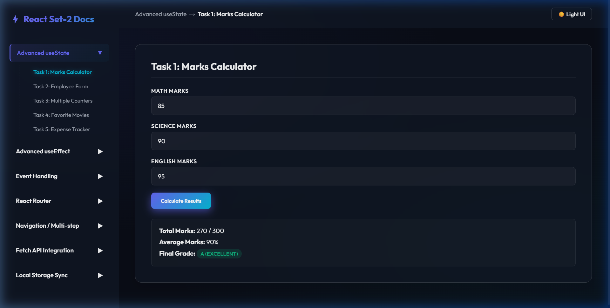
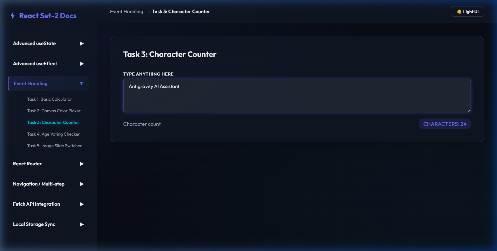
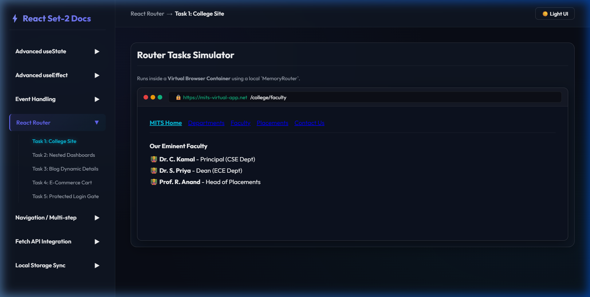

# ReactJS Advanced Tasks Sheet - Set 2

A unified, high-fidelity developer workspace consolidating **35 advanced ReactJS tasks** across 7 category groups. Built as a premium dashboard with custom states, lifecycle hooks, and virtualized browser environments.

---

## Technical Features

1. **Dashboard UI**: Responsive sidebar navigation with collapsible categories, custom Outfitters typography, and glassmorphism elements.
2. **Persistence**: Demonstrates state persistence for Username registers, dark/light themes, notes, and baskets using `localStorage` syncing.
3. **Advanced Side-Effects (`useEffect`)**: Active listeners for connection state detection (`window.addEventListener('online')`), viewport resize width logging, dynamic quotes rotation tickers, and card background color switches.
4. **Virtual Browser Routing Simulation**: A custom-designed virtual browser mockup built inside the workspace using React `MemoryRouter`. This encapsulates all **React Router** tasks (College Site routing, Nested dashboards, Blog dynamic URLs `/blog/:id`, and E-Commerce carts) with an active mock URL address bar, avoiding collisions with the root page.
5. **Flow Wizards**: Multi-step navigation wizards for banking transfers, hospital schedule logs, LMS completion cards, and food delivery checks.

---

## Directory Structure

```text
ReactJS-Set2/
├── src/
│   ├── components/
│   │   ├── useStateTasks.jsx      # Marks calculator, employee form, counters, expense sheets
│   │   ├── useEffectTasks.jsx     # API counts, online status, resizer, quote sliders, BG changer
│   │   ├── eventHandlingTasks.jsx # Calculator, color buttons, char counter, age checkers
│   │   ├── routerTasks.jsx        # Virtual browser container matching college & dashboard paths
│   │   ├── navigationTasks.jsx    # Bank registers, hospital panels, LMS lists, food checkout steps
│   │   ├── fetchApiTasks.jsx      # Comments loader, photos grids, random user API, country cards
│   │   └── localStorageTasks.jsx  # Theme settings, persistent todo lists, notebook editors
│   ├── App.jsx                    # Core dashboard panel layout & category router
│   ├── style.css                  # UI design system & responsive selectors
│   └── main.jsx                   # React mounting loader
├── index.html                     # HTML root template
├── package.json                   # Project packages mapping
└── screenshots/                   # E2E validation screen captures
```

---

## Task Details

- **Advanced useState Tasks**:
  - Marks Calculator (Math, Science, English averages & grade codes)
  - Employee Form (Department and salary badges cards)
  - Multiple Counters (Independent increment/decrements)
  - Favorite Movies (List adder & delete row buttons)
  - Expense Tracker (Cumulative outflow totals ledger)
- **Advanced useEffect Tasks**:
  - API Refresh Counter (Refreshes trigger increments)
  - Online/Offline Connection (Dynamic networks logs)
  - Screen Width Resize Tracker (Window pixel tracker)
  - Random Quote Ticker (Fades quotes every 5 seconds)
  - Background Color Changer (Switches card background every 3 seconds)
- **Event Handling Tasks**:
  - Arithmetic Calculator (Standard arithmetic operators)
  - Canvas Color Picker (Red/Blue/Green panels background switcher)
  - Character Counter (Real-time textarea lengths)
  - Voting Age Checker (Validation logs)
  - Image Slide Switcher (Previous/next CSS gradients carousel)
- **React Router Tasks (Virtual Browser)**:
  - College Site (Home, departments, placements details)
  - Nested Dashboard (Sidebar tabs inside sub-routes)
  - Blog details page (Loads dynamic parameters `/blog/:id`)
  - E-Commerce (Product catalog -> Cart checkout -> Order success)
  - Protected Dashboard (Authenticates with password 'admin')
- **Navigation Flow Tasks**:
  - Quiz Wizard App (Logs student -> Instructions -> Quiz -> Scorecard)
  - Retail Banking Ledger (Deposits, Withdrawals, and Transaction ledger)
  - Hospital Operations (Patients registers, Doctors list, appointment bookings, and bills)
  - LMS Workstation (Course modules tracker and assignments submissions)
  - Food Order Cart (Restaurant cuisines browse -> cart add -> checkout checkout)
- **Fetch API Tasks**:
  - Comments list (`jsonplaceholder.typicode.com/comments`)
  - Album indexer (`jsonplaceholder.typicode.com/albums`)
  - Photos gallery (`jsonplaceholder.typicode.com/photos`)
  - Random user cards (`randomuser.me/api/`)
  - Country capitals & population flag directory (`restcountries.com/v3.1/all`)
- **Local Storage Tasks**:
  - Name Greeter greeting card
  - Dark/Light Theme persistence
  - Persistent Todo List
  - Notes editor (Add/Edit inline/Delete)
  - Shopping Cart item quantity counters

---

## Installation & Launch

1. Navigate to the project folder:
   ```bash
   cd Major-Project/ReactJS-Set2/
   ```

2. Install dependencies:
   ```bash
   npm install
   ```

3. Launch development server:
   ```bash
   npm run dev
   ```
   Open `http://localhost:5173/` in your browser.

---

## Verification Gallery

### 1. useState Marks Calculator


### 2. Live Character Counter


### 3. Virtual Browser Routing

